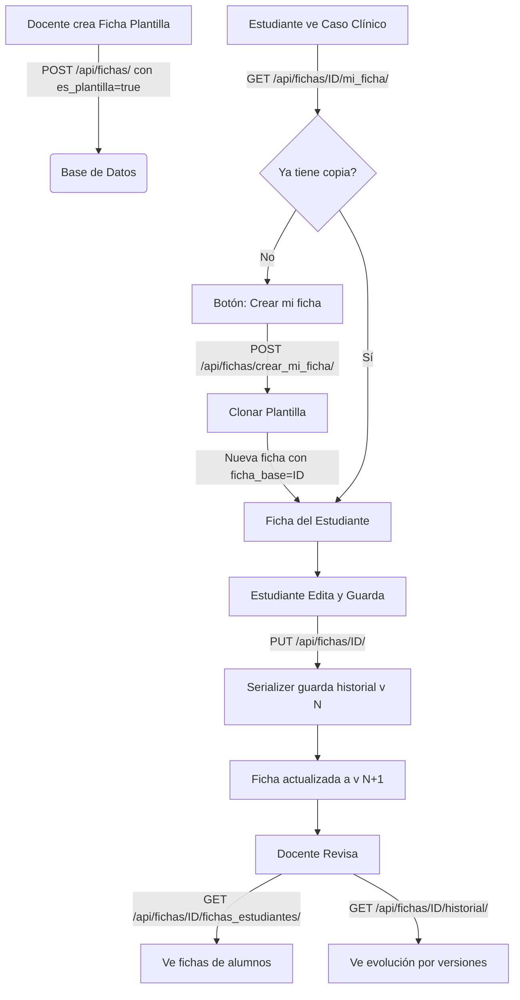

# Flujos Críticos: Fichas Clínicas

Este documento describe el ciclo de vida completo de una Ficha Clínica, desde su creación como "Caso Clínico" (Plantilla) hasta su completitud por un estudiante.

## Diagrama de Flujo

## 1. Creación de Plantilla (Rol: Docente)
- El docente navega a `/fichas/nueva` (o desde detalle de paciente con `?paciente=ID`).
- Completa los campos clínicos iniciales del caso.
- Al guardar, el backend crea una `FichaAmbulatoria` con `es_plantilla=True` y `creado_por=docente`.
- Esta ficha es visible para todos los estudiantes como "caso clínico" de solo lectura.

## 2. Clonación (Rol: Estudiante)
- El estudiante ve la plantilla en el detalle del paciente o en la lista de fichas.
- Si no ha trabajado en ella, ve el botón **"Crear mi ficha"**.
- **Backend (`crear_mi_ficha`)**:
    1. Verifica que no exista ya una ficha para el par `(ficha_base_id, estudiante_id)` — protegido además por `UniqueConstraint` en BD.
    2. Crea una **copia profunda** de la plantilla con los 8 campos clínicos.
    3. Asigna `es_plantilla=False`, vincula `ficha_base`, asigna `estudiante=user`.

## 3. Edición y Versionamiento (Automático)
- Cada vez que el estudiante (o docente) guarda cambios en una ficha (`PUT /api/fichas/{id}/`):
    1. `FichaAmbulatoriaSerializer.update()` intercepta el guardado.
    2. **Antes de guardar**: Toma snapshot de los 8 campos actuales → crea `FichaHistorial` con versión `N`.
    3. **Guarda**: Actualiza `FichaAmbulatoria` con los nuevos datos y `modificado_por=user`.
- La versión se calcula como `última_versión + 1` (o 1 si es la primera edición).

## 4. Revisión (Rol: Docente)
- El docente entra a su plantilla.
- Pestaña **"Fichas de Estudiantes"**: Lista todos los alumnos que han clonado esta plantilla (`GET /api/fichas/{id}/fichas_estudiantes/`).
- Al entrar a la ficha de un alumno, pestaña **"Historial"**: Muestra la evolución por versiones.
- Puede **"viajar en el tiempo"** seleccionando versiones anteriores para ver cómo evolucionó el trabajo del estudiante.

## 5. Permisos por Acción

| Acción | Quién puede |
|--------|-------------|
| Crear plantilla | Docente, Admin |
| Clonar plantilla | Estudiante |
| Editar ficha propia | Estudiante (dueño) |
| Editar cualquier ficha | Docente, Admin |
| Ver historial | Cualquier autenticado (sobre fichas a las que tiene acceso) |
| Ver fichas de estudiantes | Docente, Admin |
| Eliminar ficha | Dueño, Docente, Admin |
