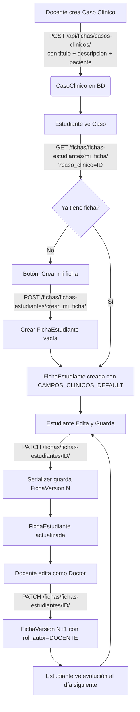

# Flujos Críticos: Fichas Clínicas

Este documento describe el ciclo de vida completo de una Ficha Clínica, desde la creación del Caso Clínico hasta su completitud por un estudiante.

## Arquitectura de 2 Modelos Principales

```
CasoClinico ──(1:N)──→ FichaEstudiante ──(1:N)──→ FichaVersion
     │
Paciente (N:1)
```

- **CasoClinico**: Entidad central con título, descripción narrativa y paciente asociado. Creada por docentes.
- **FichaEstudiante**: Ficha individual del estudiante en un caso. Constraint único `(caso_clinico, estudiante)`. Contenido JSON inicia vacío.
- **FichaVersion**: Snapshot automático del contenido al editar una FichaEstudiante.

## Diagrama de Flujo



## 1. Creación de Caso Clínico (Rol: Docente)
- El docente navega a `/casos-clinicos/nuevo`.
- Completa título, descripción narrativa del escenario clínico y selecciona un paciente.
- Al guardar, el backend crea un `CasoClinico` con `creado_por=docente`.
- La descripción es texto libre que describe el escenario para los estudiantes.

## 2. Creación de Ficha (Rol: Estudiante)
- El estudiante accede a un caso clínico.
- Si no ha trabajado en él, ve el botón **"Crear mi ficha"**.
- **Backend (`crear_mi_ficha`)**:
    1. Verifica que no exista una ficha para el par `(caso_clinico, estudiante)` — protegido por `UniqueConstraint`.
    2. Crea `FichaEstudiante` con contenido vacío (`CAMPOS_CLINICOS_DEFAULT` — 8 campos clínicos en blanco).
    3. Asigna `estudiante=user` y `creado_por=user`.

## 3. Edición y Versionamiento (Automático)
- Cada vez que se guarda cambios en una FichaEstudiante (`PATCH /fichas/fichas-estudiantes/{id}/`):
    1. `FichaEstudianteSerializer.update()` intercepta el guardado.
    2. **Antes de guardar**: Toma snapshot del `contenido` JSON actual → crea `FichaVersion` con versión `N` y `rol_autor` del usuario (método `_guardar_version()`).
    3. **Guarda**: Actualiza `FichaEstudiante` con el nuevo `contenido` y `modificado_por=user`.
- La versión se calcula como `última_versión + 1` (o 1 si es la primera edición).

## 4. Evolución por el Docente (Rol: "Doctor")
- El docente entra a la ficha del estudiante (desde la pestaña "Fichas de Estudiantes" del caso clínico).
- Edita el `contenido` simulando una evolución del paciente (nuevos signos vitales, indicaciones, etc.).
- Al guardar, `FichaVersion` registra `rol_autor=DOCENTE`, dejando claro quién hizo cada versión.
- Al día siguiente, el estudiante ve el nuevo estado del paciente.

## 5. Revisión (Rol: Docente)
- El docente entra al caso clínico.
- Pestaña **"Fichas de Estudiantes"**: Lista todas las FichasEstudiantes del caso.
- Al entrar a una ficha, pestaña **"Historial"**: Muestra la evolución por versiones con `rol_autor`.
- Puede **"viajar en el tiempo"** seleccionando versiones anteriores.

## 6. Permisos por Acción

| Acción | Quién puede |
|--------|-------------|
| Crear caso clínico | Docente, Admin |
| Editar caso clínico | Docente, Admin |
| Crear ficha (crear_mi_ficha) | Estudiante |
| Editar ficha propia | Estudiante (dueño) |
| Editar cualquier ficha | Docente, Admin |
| Ver historial | Cualquier autenticado (sobre fichas a las que tiene acceso) |
| Ver fichas de estudiantes | Docente, Admin |
| Eliminar caso clínico | Docente, Admin (409 si tiene fichas) |
| Eliminar ficha | Dueño, Docente, Admin |

## 7. Protección de datos (on_delete)

| Relación | on_delete | Razón |
|----------|-----------|-------|
| `CasoClinico.paciente` | `PROTECT` | No se puede borrar paciente con casos (409) |
| `FichaEstudiante.caso_clinico` | `PROTECT` | No se puede borrar caso con fichas (409) |
| `FichaEstudiante.estudiante` | `SET_NULL` | Si se borra usuario, fichas se conservan |
| `FichaVersion.ficha` | `CASCADE` | Si se borra ficha, se borran sus versiones |
| `*.creado_por`, `*.modificado_por` | `SET_NULL` | Trazabilidad se conserva como null |

Los ViewSets de CasoClinico y Paciente implementan `destroy()` con pre-check: cuentan los hijos y retornan HTTP **409 Conflict** con mensaje descriptivo antes de que Django lance `ProtectedError`. El frontend muestra el `detail` del 409 vía componente Toast.

## 8. Rutas Frontend

| Ruta | Página | Descripción |
|------|--------|-------------|
| `/casos-clinicos` | FichaListPage | Lista de casos clínicos |
| `/casos-clinicos/nuevo` | FichaFormPage | Crear caso clínico |
| `/casos-clinicos/:id` | FichaDetailPage | Detalle con pestañas (descripción, fichas estudiantes) |
| `/casos-clinicos/:id/editar` | FichaFormPage | Editar caso clínico |
| `/fichas/estudiante/:id` | FichaEstudianteDetailPage | Detalle de ficha con edición e historial |

## NO IMPLEMENTADO (Futuro)

- Jornadas con visibilidad controlada (Día 1 AM, Día 1 PM, etc.)
- Roles simulados ("Dr. García - Médico de turno")
- Liberación progresiva de información
- Reinicio de caso por rotación
- Exportación a PDF
