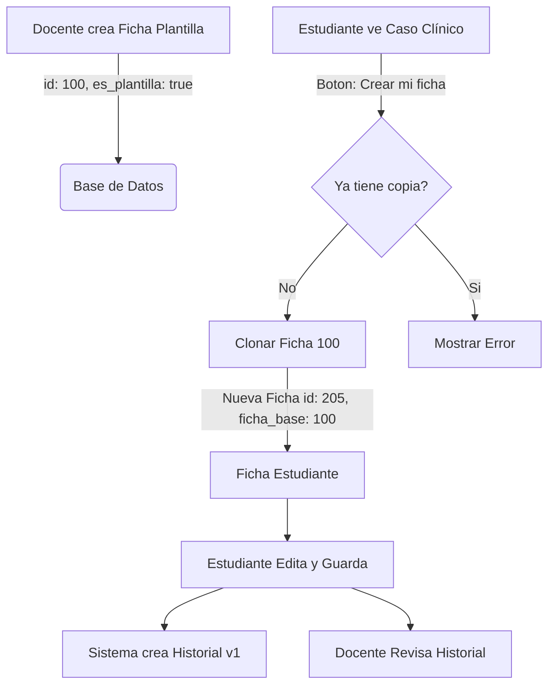

# Flujos Críticos: Fichas Clínicas

Este documento describe el ciclo de vida completo de una Ficha Clínica, desde su creación como "Caso Clínico" (Plantilla) hasta su completitud por un estudiante.

## Diagrama de Flujo (Simplificado)

## 1. Creación de Plantilla (Rol: Docente)
- El docente accede a `/fichas/nueva`.
- Al guardar, el backend crea una `FichaAmbulatoria` con `es_plantilla=True`.
- Esta ficha sirve "solo lectura" para los estudiantes, actuando como el enunciado del problema.

## 2. Asignación/Clonación (Rol: Estudiante)
- El estudiante navega a `/pacientes/{id}` y selecciona un caso.
- Si no ha trabajado en él, ve el botón **"Crear mi ficha"**.
- **Backend (`crear_mi_ficha`)**:
    1. Verifica que no exista ya una ficha para este par `(ficha_base_id, estudiante_id)`.
    2. Crea una **Copia Profunda** de la plantilla.
    3. Asigna `es_plantilla=False` y vincula `ficha_base`.
    4. Copia todos los campos clínicos (anamnesis, etc.) para que el estudiante tenga el punto de partida.

## 3. Edición y Versionamiento (Automático)
- Cada vez que el estudiante guarda cambios en su ficha (`PUT /api/fichas/{id}/`):
    - El `FichaAmbulatoriaSerializer` intercepta el guardado.
    - **Antes de guardar**: Toma los datos actuales (viejos) y crea un registro en `FichaHistorial` con la versión `N`.
    - **Guarda**: Actualiza la ficha `FichaAmbulatoria` con los nuevos datos (Versión `N+1`).

## 4. Revisión (Rol: Docente)
- El docente entra a su propia plantilla.
- Pestaña **"Fichas de Estudiantes"**: Lista todos los alumnos que han clonado esta plantilla.
- Al entrar a la ficha de un alumno, ve la pestaña **"Historial"**.
- Puede "viajar en el tiempo" seleccionando versiones anteriores para ver cómo evolucionó el diagnóstico.
