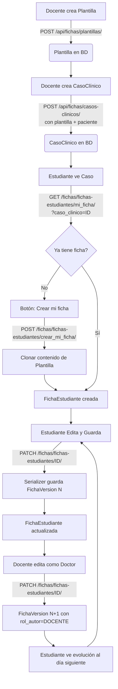

# Flujos Críticos: Fichas Clínicas

Este documento describe el ciclo de vida completo de una Ficha Clínica, desde su creación como Plantilla hasta su completitud por un estudiante.

## Arquitectura de 3 Modelos

```
Plantilla ──(1:N)──→ CasoClinico ──(1:N)──→ FichaEstudiante ──(1:N)──→ FichaVersion
                         │
                    Paciente (1:N)
```

- **Plantilla**: Caso clínico base (título, descripción, contenido JSON). Creada por docentes.
- **CasoClinico**: Vincula una Plantilla con un Paciente. Constraint único `(plantilla, paciente)`.
- **FichaEstudiante**: Ficha individual del estudiante en un caso. Constraint único `(caso_clinico, estudiante)`.
- **FichaVersion**: Snapshot automático del contenido al editar una FichaEstudiante.

## Diagrama de Flujo



## 1. Creación de Plantilla (Rol: Docente)
- El docente navega a `/plantillas/nueva`.
- Completa título, descripción y los campos clínicos iniciales (almacenados como JSON en `contenido`).
- Al guardar, el backend crea una `Plantilla` con `creado_por=docente`.
- Si no envía `contenido`, se inicializa con `CAMPOS_CLINICOS_DEFAULT` (8 campos vacíos).

## 2. Creación de Caso Clínico (Rol: Docente)
- Desde el detalle de una Plantilla, pestaña "Casos Clínicos".
- Selecciona un paciente en el `PacienteSelect` (autocomplete).
- Crea un `CasoClinico` que vincula la Plantilla con el Paciente.
- **Restricción**: Un paciente solo puede tener un caso por plantilla (`UniqueConstraint`).

## 3. Clonación (Rol: Estudiante)
- El estudiante accede a un caso clínico.
- Si no ha trabajado en él, ve el botón **"Crear mi ficha"**.
- **Backend (`crear_mi_ficha`)**:
    1. Verifica que no exista una ficha para el par `(caso_clinico, estudiante)` — protegido por `UniqueConstraint`.
    2. Crea `FichaEstudiante` con copia del `contenido` JSON de la Plantilla del caso.
    3. Asigna `estudiante=user` y `creado_por=user`.

## 4. Edición y Versionamiento (Automático)
- Cada vez que se guarda cambios en una FichaEstudiante (`PATCH /fichas/fichas-estudiantes/{id}/`):
    1. `FichaEstudianteSerializer.update()` intercepta el guardado.
    2. **Antes de guardar**: Toma snapshot del `contenido` JSON actual → crea `FichaVersion` con versión `N` y `rol_autor` del usuario (método `_guardar_version()`).
    3. **Guarda**: Actualiza `FichaEstudiante` con el nuevo `contenido` y `modificado_por=user`.
- La versión se calcula como `última_versión + 1` (o 1 si es la primera edición).

## 5. Evolución por el Docente (Rol: "Doctor")
- El docente entra a la ficha del estudiante (desde la pestaña "Fichas de Estudiantes" de la plantilla).
- Edita el `contenido` simulando una evolución del paciente (nuevos signos vitales, indicaciones, etc.).
- Al guardar, `FichaVersion` registra `rol_autor=DOCENTE`, dejando claro quién hizo cada versión.
- Al día siguiente, el estudiante ve el nuevo estado del paciente.

## 6. Revisión (Rol: Docente)
- El docente entra a su plantilla.
- Pestaña **"Fichas de Estudiantes"**: Lista todas las FichasEstudiantes a través de los CasosClinicos.
- Al entrar a una ficha, pestaña **"Historial"**: Muestra la evolución por versiones con `rol_autor`.
- Puede **"viajar en el tiempo"** seleccionando versiones anteriores.

## 7. Permisos por Acción

| Acción | Quién puede |
|--------|-------------|
| Crear plantilla | Docente, Admin |
| Crear caso clínico | Docente, Admin |
| Clonar caso (crear ficha) | Estudiante |
| Editar ficha propia | Estudiante (dueño) |
| Editar cualquier ficha | Docente, Admin |
| Ver historial | Cualquier autenticado (sobre fichas a las que tiene acceso) |
| Ver fichas de estudiantes | Docente, Admin |
| Eliminar plantilla | Dueño, Docente, Admin (409 si tiene casos) |
| Eliminar caso clínico | Dueño, Docente, Admin (409 si tiene fichas) |
| Eliminar ficha | Dueño, Docente, Admin |

## 8. Protección de datos (on_delete)

| Relación | on_delete | Razón |
|----------|-----------|-------|
| `CasoClinico.plantilla` | `PROTECT` | No se puede borrar plantilla con casos (409) |
| `CasoClinico.paciente` | `PROTECT` | No se puede borrar paciente con casos (409) |
| `FichaEstudiante.caso_clinico` | `PROTECT` | No se puede borrar caso con fichas (409) |
| `FichaEstudiante.estudiante` | `SET_NULL` | Si se borra usuario, fichas se conservan |
| `FichaVersion.ficha` | `CASCADE` | Si se borra ficha, se borran sus versiones |
| `*.creado_por`, `*.modificado_por` | `SET_NULL` | Trazabilidad se conserva como null |

Los ViewSets de Plantilla, CasoClinico y Paciente implementan `destroy()` con pre-check: cuentan los hijos y retornan HTTP **409 Conflict** con mensaje descriptivo antes de que Django lance `ProtectedError`. El frontend muestra el `detail` del 409 vía componente Toast.

## 9. Rutas Frontend

| Ruta | Página | Descripción |
|------|--------|-------------|
| `/plantillas` | FichaListPage | Lista de plantillas |
| `/plantillas/nueva` | FichaFormPage | Crear plantilla |
| `/plantillas/:id` | FichaDetailPage | Detalle con pestañas (contenido, casos, estudiantes) |
| `/plantillas/:id/editar` | FichaFormPage | Editar plantilla |
| `/fichas/estudiante/:id` | FichaEstudianteDetailPage | Detalle de ficha con edición e historial |

## NO IMPLEMENTADO (Futuro)

- Jornadas con visibilidad controlada (Día 1 AM, Día 1 PM, etc.)
- Roles simulados ("Dr. García - Médico de turno")
- Liberación progresiva de información
- Reinicio de caso por rotación
- Exportación a PDF
